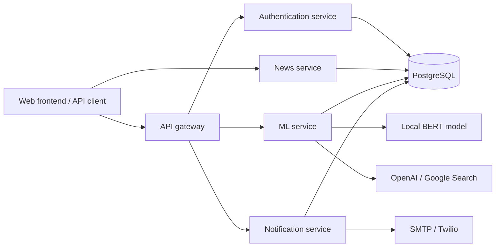

# HealthCheck Backend

**Health news analysis with BERT, structured article data, and user notifications.**

HealthCheck helps users examine health-related news by classifying article text, collecting source information, and keeping a history of their consultations. This repository contains the API gateway and backend services; the web frontend is maintained separately.

The backend combines Node.js services for application features with a Python service for machine learning, article extraction, and a search-assisted chatbot. PostgreSQL stores users, articles, classifications, model metadata, and notification preferences.

## Capabilities

- **Article analysis:** submit text or a URL for BERT classification, topic assignment, and keyword extraction.
- **News management:** browse and search articles, manage sources and topics, record interactions, and submit reports.
- **User accounts:** register, sign in with JWT authentication or Google OAuth, and manage profiles.
- **Consultation history:** retrieve and delete a user's previous consultations.
- **Notifications:** deliver email and SMS alerts based on topics and user preferences.
- **Model management:** train models, list versions, and select an active model.
- **Content collection:** collect Google News articles and X/Twitter posts through scraper endpoints and scheduled jobs.
- **Conversational assistance:** investigate news with a LangChain chatbot connected to OpenAI and Google Custom Search.

## Architecture

Each service runs as a separate process. The gateway exposes authentication, ML, and notification routes. The news API currently runs separately and is accessed directly.



| Component | Stack | Local port | Purpose |
| --- | --- | --- | --- |
| API gateway | Express, TypeScript | `4000` | Forwarding, authentication checks, rate limiting |
| Authentication | Express, Passport, Sequelize | `3001` | Accounts, JWT, Google OAuth |
| News | Express, Sequelize, TypeScript | `3003` | Articles, search, reports, statistics, history |
| Notifications | Express, Nodemailer, Twilio | `3004`* | Email, SMS, preferences, scheduled delivery |
| Machine learning | Flask, PyTorch, Transformers, LangChain | `5000` | Classification, training, scraping, chatbot |

*Set `PORT=3004` for notifications. Its code defaults to `3001`, which conflicts with authentication; the gateway expects notifications on `3004`.*

## Repository layout

```text
HealthcheckBack/
├── api-gateway/                  # Gateway routes and middleware
├── services/
│   ├── auth-service/             # Authentication and profiles
│   ├── news-service/             # News, interactions, and history
│   ├── notification-service/     # Notification delivery and scheduling
│   └── ml-service/
│       ├── api/routes/           # Classification, training, and chat APIs
│       ├── core/                 # Model loading and inference
│       ├── database/             # SQLAlchemy models and connection
│       ├── models/               # BERT weights and tokenizer assets
│       ├── scrapers/             # Google News and X/Twitter collection
│       └── utils/                # Article extraction and data processing
├── db.sql                        # PostgreSQL schema
└── .gitignore
```

## Local setup

### 1. Prerequisites

Install Git with Git LFS, Node.js with npm, Python with pip and virtual environment support, and PostgreSQL. Runtime versions are not pinned at repository level. Python dependencies are pinned in [requirements.txt](services/ml-service/requirements.txt), and Node.js services include npm lockfiles.

External integrations use Google OAuth, OpenAI, Google Custom Search, SMTP, and Twilio. Configure credentials for the services you start; some clients, including the ML chatbot, are initialized at startup.

### 2. Clone and download model weights

```bash
git lfs install
git clone https://github.com/AndrewMtz23/HealthcheckBack.git
cd HealthcheckBack
git lfs pull
git lfs ls-files
```

The BERT weights use Git LFS. `pytorch_model.bin` and `model.safetensors` total approximately **879 MB**, excluding dependencies. Tokenizer and model configuration files are tracked in regular Git.

### 3. Create the database

With PostgreSQL running, execute from the repository root:

```bash
createdb -U postgres healthcheck
psql -U postgres -d healthcheck -f db.sql
```

Use an empty database: the SQL file creates types and tables and is not a repeatable migration script. It does not seed an active ML model. Classification requires an active record in `modelos_ml`, in addition to the model files on disk; provision this metadata before testing predictions.

### 4. Configure the services

Create a `.env` file inside each service directory and inside `api-gateway/`. These files are ignored by Git.

Authentication, news, notifications, and ML share these database settings:

```dotenv
DB_HOST=localhost
DB_PORT=5432
DB_NAME=healthcheck
DB_USER=postgres
DB_PASSWORD=replace-with-your-local-password
```

Additional settings are listed below. Follow the source links for the configuration definitions.

| Service | Settings |
| --- | --- |
| [Gateway](api-gateway/src/config/index.ts) | `PORT=4000`, `JWT_SECRET`, `ALLOWED_ORIGINS=http://localhost:3000`, `AUTH_SERVICE_URL=http://localhost:3001/api`, `ML_SERVICE_URL=http://localhost:5000/api`, `NOTIFICATIONS_SERVICE_URL=http://localhost:3004/api` |
| [Authentication](services/auth-service/src/config/env.ts) | `PORT=3001`, `JWT_SECRET`, `JWT_EXPIRATION=86400`, `FRONTEND_URL=http://localhost:3000`, `GOOGLE_CLIENT_ID`, `GOOGLE_CLIENT_SECRET`, `GOOGLE_CALLBACK_URL=http://localhost:3001/api/auth/google/callback` |
| [News](services/news-service/src/config/index.ts) | `PORT=3003`, `JWT_SECRET`, `FRONTEND_URL=http://localhost:3000` |
| [Notifications](services/notification-service/src/config/) | `PORT=3004`, `FRONTEND_URL=http://localhost:3000`, `EMAIL_HOST`, `EMAIL_PORT`, `EMAIL_SECURE`, `EMAIL_USER`, `EMAIL_PASS`, `TWILIO_ACCOUNT_SID`, `TWILIO_AUTH_TOKEN`, `TWILIO_PHONE_NUMBER` |
| [ML](services/ml-service/config.py) | `SECRET_KEY`, `MODEL_PATH=models/bert_health_model`; chatbot: `OPENAI_API_KEY`, `GOOGLE_API_KEY`, `GOOGLE_CX` |

Use the same `JWT_SECRET` in the gateway, authentication, and news services. Register the configured Google callback URL in your OAuth application. The ML development server uses port `5000` in `app.py`.

### 5. Start the Node.js services

Open a separate terminal in each directory:

```text
api-gateway/
services/auth-service/
services/news-service/
services/notification-service/
```

Run in each terminal:

```bash
npm ci
npm run dev
```

The TypeScript services also provide `npm run build` and `npm start` to compile and run their JavaScript output. Notifications runs JavaScript directly with `npm start`.

### 6. Start the ML service

From `services/ml-service/`, create a virtual environment:

```bash
python -m venv .venv
```

Activate it on Windows PowerShell:

```powershell
.\.venv\Scripts\Activate.ps1
```

Or on macOS/Linux:

```bash
source .venv/bin/activate
```

Install dependencies and start Flask:

```bash
python -m pip install -r requirements.txt
python -m pip install flask-cors
python app.py
```

`flask-cors` is imported by the application but is currently missing from `requirements.txt`, so it is installed separately above. Initial startup also downloads NLTK resources and requires internet access. Run from the service directory so relative model paths resolve correctly.

## API reference

These are representative routes. Consult each service's route modules for request schemas, access requirements, and the full endpoint list.

| Service / port | Method | Path | Purpose |
| --- | --- | --- | --- |
| Gateway / `4000` | `GET` | `/health` | Gateway health |
| Authentication / `3001` | `POST` | `/api/auth/register` | Create an account |
| Authentication / `3001` | `POST` | `/api/auth/login` | Sign in |
| Authentication / `3001` | `GET` | `/api/auth/profile` | Retrieve the authenticated profile |
| News / `3003` | `GET` | `/api/health` | News service health |
| News / `3003` | `GET` | `/api/news` | List articles |
| News / `3003` | `GET` | `/api/history` | Retrieve consultation history |
| Notifications / `3004` | `GET` | `/` | Notification service health |
| ML / `5000` | `POST` | `/api/ml/classify/predict` | Analyze text or an article URL |
| ML / `5000` | `POST` | `/api/ml/train/train` | Start model training |
| ML / `5000` | `GET` | `/api/ml/train/models` | List models |
| ML / `5000` | `POST` | `/api/ml/chatbot/chat` | Send a chatbot message |

Protected routes expect `Authorization: Bearer <token>`. The gateway requires authentication for prediction requests. The example below uses the direct local ML interface; classification writes article and classification records to PostgreSQL.

```http
POST /api/ml/classify/predict HTTP/1.1
Host: localhost:5000
Content-Type: application/json

{
  "text": "Paste the health news article to analyze here."
}
```

For URL analysis, replace `text` with a `url` field containing the article address. The classifier uses the labels `verdadera` and `falsa`. Its reported score is the model's probability for the `verdadera` class, expressed as a percentage; it is not necessarily the probability of the predicted class.

## Development notes

- **Model evaluation:** the repository does not publish benchmark results or calibrated accuracy claims. Predictions are model output requiring source verification.
- **Startup behavior:** ML starts scheduled scraping jobs, and notifications processes pending work on startup. Use a development database and appropriate integration accounts.
- **Deployment:** `python app.py` enables Flask debug mode. There is no complete container setup; the ML `Dockerfile` is currently empty.
- **Verification:** these instructions are based on the checked-in code. A complete installation and end-to-end run have not been validated as part of the repository separation.

## Contributing

Keep changes scoped to the affected service, document configuration or API changes, and include the checks used to verify behavior. Commit lockfile updates when changing Node.js dependencies. Keep credentials, virtual environments, generated models, and runtime output out of commits; the bundled BERT weights remain tracked through Git LFS.

## Attribution and license metadata

This repository preserves the backend history extracted from the original HealthCheck project. Existing contributor attribution and package license declarations are retained. Node.js packages declare `ISC` in their manifests; a standalone repository-wide license file is not currently included.
